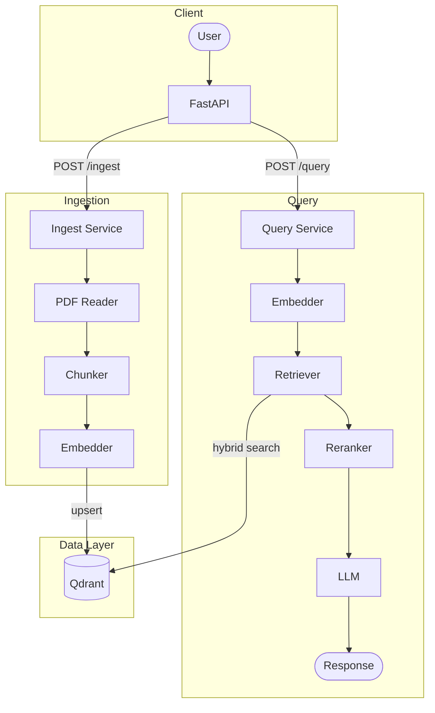
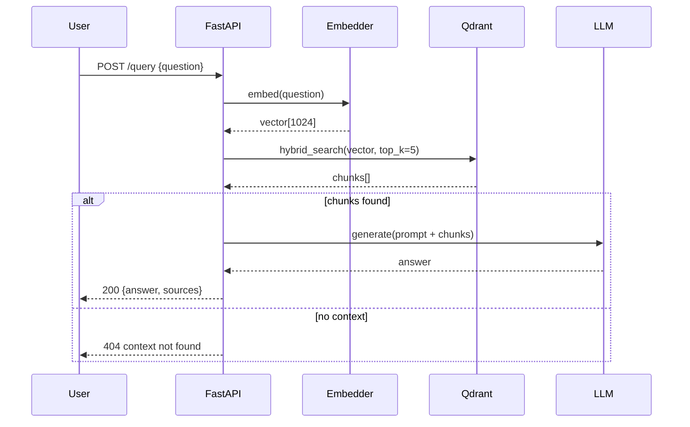

# Document RAG (Retrieval-Augmented Generation)
Implementasi dari Retrieval-Augmented Generation (RAG) dengan memanfaatkan hybrid search (dense vector + BM25) dan reranking menggunakan [Qwen3-Embedding-0.6B](https://huggingface.co/Qwen/Qwen3-Embedding-0.6B) dan [Llama-3.2-3B-Instruct-AWQ](https://huggingface.co/AMead10/Llama-3.2-3B-Instruct-AWQ).


## Diagram Arsitektur

### High level Arsitektur


Sistem terdiri dari 2 pipiline utama yaitu **Ingestion** dan **Query**. Ingestion bertujuan untuk memproses dan mengindeks dokumen hingga disimpan pada vector database. Sedangkan untuk Query bertujuan untuk menjawab pertanyaan berdasarkan konteks yang diperoleh dari vector database.

### Cara Kerja

Sistem berjalan dimulai dari User yang melakukan perintah query atau memberikan pertanyaan. Query akan diubah mencari vector dan kemudian dilakukan pencarian hybrid search untuk mendapatkan konteks/chunks yang mirip dengan query tersebut. Apabila chunk ditemukan maka prompt pertanyaan dan chunk yang sesuai akan dikirim pada LLM yang nanti akan generate jawaban yang dikembalikan pada User.

## Keputusan Desain
1. **Chunking** : Menggunakan Markdown-aware splitting, dokumen akan dipecah berdasarkan markdown sectionnya (heading). Kemudian tiap section yang melebihi 512 kata akan dipecah kembali menggunakan sentense aware splitting dengan overlap 64. Pendekatan ini dipilih karena dokumen pdf akan diekstrak menggunakan **pymupdf4llm** yang menghasilkan markdown.
2. **Embedding Model** : Menggunakan **Qwen3-Embedding-0.6B** yang mendukung multi bahasa dengan ukuran yang hanya 0.6B.
3. **Hybrid Search** : Menggabungkan dense vector search dan sparse BM25 di Qdrant. Dense search unggul untuk semantic similarity, BM25 unggul untuk exact keyword match.
4. **Reranker** : Menggunakan **BAAI/bge-reranker-v2-m3** yang dipilih karena mendukung multibahasa.
5. **LLM** : Menggunakan **Llama-3.2-3B-Instruct-AWQ** yang di-serve via vLLM dengan OpenAI-compatible API.
Versi AWQ (quantized) dipilih untuk mengurangi VRAM usage.

### Folder Stuktur
```
.
├── Dockerfile
├── README.md
├── data                            # digunakan untuk menyimpan data
├── docker-compose.yml           
├── docs                            # Dokumentasi tambahan
├── logs
├── main.py
├── notebook                        # Research & eksperimen
│   └── 1-research.ipynb
├── pyproject.toml                  # dependency (using uv package manager)
├── src
│   ├── api
│   │   └── routes                  # FastAPI Router
│   ├── config.py                   # Settings via pydantic-settings
│   ├── core
│   │   ├── chunker.py
│   │   ├── embedder.py
│   │   ├── llm_client.py
│   │   ├── pdf_parser.py
│   │   ├── pipeline.py
│   │   ├── reranker.py
│   │   ├── sparse.py
│   │   └── vector_store.py
│   ├── main.py
│   └── utils
│       ├── check_services.py
│       └── logger.py               # Logging setup
├── tests                           # Unit & integration test
└── uv.lock
```

## Trade-off & Keterbatasan
| Komponen | Trade-off |
|---|---|
| Hybrid Search | Lebih lambat dari pure vector search, tapi relevansi hasil lebih tinggi |
| Reranker | Menambah latency per request, tapi mengurangi false positive di top result |
| Llama-3.2-3B-AWQ | Model kecil dan hemat VRAM, tapi kualitas jawaban terbatas untuk pertanyaan kompleks |
| Qwen3-Embedding-0.6B | Model ringan dan cepat, tapi dimensi vektor lebih kecil dibanding model embedding yang lebih besar |
| Tidak ada caching | Setiap query selalu hit Qdrant dan LLM, tapi menghindari stale result untuk dokumen yang sering diupdate |
| Markdown-based chunking | Efektif untuk dokumen terstruktur, tapi akan kurang bagus untuk PDF hasil OCR yang tidak punya heading |

## Cara Menjalankan
### Prasyarat Sistem (Prerequisites)
Sebelum menjalankan program, pastikan perangkat sudah memiliki:
1.  **NVIDIA Driver:** Versi terbaru yang mendukung CUDA. [Panduan Instalasi](https://www.nvidia.com/en-us/drivers/).
2.  **Docker & Docker Compose:** Untuk kontainerisasi layanan. [Dokumentasi Docker](https://docs.docker.com/get-started/get-docker/).
3.  **NVIDIA Container Toolkit:** Agar Docker dapat mengakses GPU. [Instruksi Instalasi](https://docs.nvidia.com/datacenter/cloud-native/container-toolkit/latest/install-guide.html).

### Spesifikasi Model
Sistem menggunakan model yang berjalan sepenuhnya secara lokal:

| Komponen | Model |
|---|---|
| LLM | [Llama-3.2-3B-Instruct-AWQ](https://huggingface.co/AMead10/Llama-3.2-3B-Instruct-AWQ) |
| Embedding | [Qwen3-Embedding-0.6B](https://huggingface.co/Qwen/Qwen3-Embedding-0.6B) |
| Reranker | [BAAI/bge-reranker-v2-m3](https://huggingface.co/BAAI/bge-reranker-v2-m3) |

### Langkah Instalasi
```bash
git clone https://github.com/fiqihfathor/document-rag.git
cd document-rag
cp .env.example .env
docker compose up -d
```

API tersedia di `http://localhost:8080/docs`

## Pengembangan Selanjutnya
- **HyDE (Hypothetical Document Embedding)** : sebelum retrieval, LLM di-prompt untuk menghasilkan dokumen hipotetis yang menjawab pertanyaan, kemudian dokumen hipotetis tersebut yang di-embed dan digunakan untuk mencari chunk yang relevan di Qdrant. Pendekatan ini meningkatkan recall karena embedding dokumen lebih dekat secara semantik dengan chunk yang tersimpan dibanding embedding pertanyaan langsung
- **Caching** : integrasi Redis untuk menyimpan hasil query yang sering diulang, sehingga mengurangi latency dan beban ke Qdrant dan LLM
- **Evaluation Pipeline** — implementasi RAGAS untuk mengukur metrik seperti `faithfulness`, `answer_relevancy`, dan `context_precision` secara otomatis, sehingga kualitas retrieval dan generation bisa diukur secara kuantitatif dan tidak hanya berdasarkan uji manual
- **Observability** — integrasi Langfuse (self-hosted) untuk tracing setiap tahap pipeline secara end-to-end, mulai dari embedding, retrieval, reranking, hingga generation, sehingga bottleneck latency dapat diidentifikasi secara granular
- **Autentikasi** — penambahan API key atau JWT untuk mengamankan endpoint, terutama `/ingest` dan `/query`, sebelum sistem di-deploy di lingkungan production

## Pernyataan
Saya menyatakan bahwa seluruh pengerjaan assessment ini diselesaikan tanpa bantuan tools berbasis AI
(ChatGPT, Copilot, Cursor, Claude, dan sejenisnya).
Semua referensi yang digunakan berasal dari dokumentasi resmi, StackOverflow, dan sumber open-source.

## Referensi

1. [Qdrant Hybrid Search Documentation](https://qdrant.tech/documentation/concepts/hybrid-queries/)
2. [Text Embeddings Inference — Hugging Face](https://huggingface.co/docs/text-embeddings-inference)
3. [vLLM Documentation](https://docs.vllm.ai)
4. [BAAI/bge-reranker-v2-m3](https://huggingface.co/BAAI/bge-reranker-v2-m3)
5. [Qwen3-Embedding](https://huggingface.co/Qwen/Qwen3-Embedding-0.6B)
6. [AMead10/Llama-3.2-3B-Instruct-AWQ](https://huggingface.co/AMead10/Llama-3.2-3B-Instruct-AWQ)
7. [25 chunking tricks for RAG that devs actually use](https://medium.com/@dev_tips/25-chunking-tricks-for-rag-that-devs-actually-use-12bebd0375bc)
8. [Open Source Embedding Models](https://www.bentoml.com/blog/a-guide-to-open-source-embedding-models)
9. [Advanced RAG — Improving retrieval using Hypothetical Document Embeddings(HyDE)](https://medium.aiplanet.com/advanced-rag-improving-retrieval-using-hypothetical-document-embeddings-hyde-1421a8ec075a)